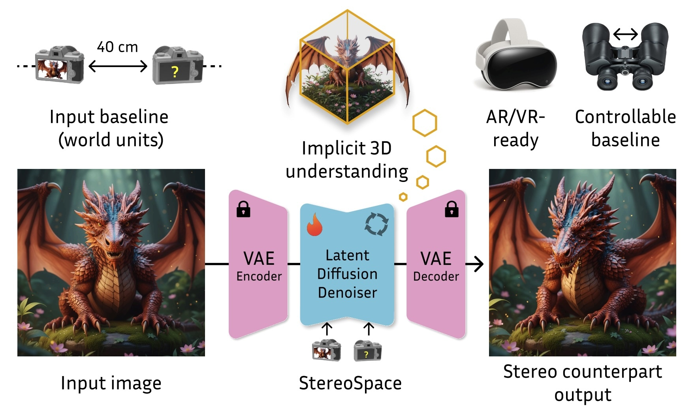
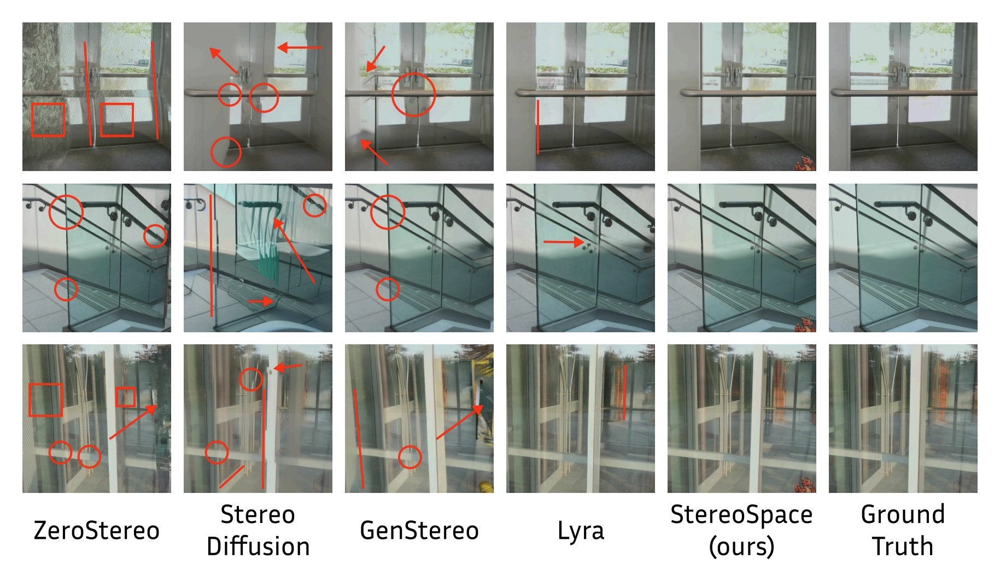

<h1 style="text-align:center;">StereoSpace: Depth-Free Synthesis of Stereo Geometry via End-to-End Diffusion in a Canonical Space</h1>

<p align="center">
  <a href="https://huggingface.co/spaces/prs-eth/stereospace_web"></a>
  <a href="https://arxiv.org/abs/2512.10959"></a>
  <a href="https://huggingface.co/prs-eth/stereospace-v1-0"></a>
  <a href="LICENSE.txt"></a>
</p>

<p align="center">
  <b>Tjark Behrens</b><sup>1</sup>,
  <b>Anton Obukhov</b><sup>3</sup>,
  <b>Bingxin Ke</b><sup>1</sup>,
  <b>Fabio Tosi</b><sup>2</sup>,
  <b>Matteo Poggi</b><sup>2</sup>,
  <b>Konrad Schindler</b><sup>1</sup>
  <br>
  <sub>
    <sup>1</sup>ETH Zurich &nbsp;&nbsp;|&nbsp;&nbsp;
    <sup>2</sup>University of Bologna &nbsp;&nbsp;|&nbsp;&nbsp;
    <sup>3</sup>Huawei Bayer Lab
  </sub>
</p>

This repository is the official implementation of the paper titled "StereoSpace: Depth-Free Synthesis of Stereo Geometry via End-to-End Diffusion in a Canonical Space". 

 

## Quick Start
### Environment & Requirements

Create and activate the environment:
```bash
git clone https://github.com/prs-eth/stereospace.git
cd stereospace
python -m venv ~/venv_stereospace
source ~/venv_stereospace/bin/activate
pip install -r requirements.txt
```

### Inference

```bash
python inference.py
```

This will:

- ⬇️ Download the necessary checkpoints. If you are prompted to log in, please provide a read access token from Hugging Face → Settings → Access Tokens. When asked 'Add token as git credential? (Y/n)', select 'n'. 
- 👀 Create stereo from input images; without specifying `--input`, it will use the `example_images` directory.
- 💾 Save predictions to an output folder.

You can also pass the following arguments:

- `--input INPUT`: Input image or a directory path, default `./example_images`;
- `--output OUTPUT`: Output directory, default `./outputs`;
- `--baseline BASELINE`: Baseline, default `0.15` (15 cm);
- `--batch_size BATCH_SIZE`: Batch size when processing a folder of images, default is 1;
- `--src_intrinsics`, `--tgt_intrinsics`: Camera intrinsics for precise control of the FOV, default is a standard camera.

## Troubleshooting

| Problem                                                                                                                                      | Solution                                                       |
|----------------------------------------------------------------------------------------------------------------------------------------------|----------------------------------------------------------------|
| (pip) Errors installing requirements via `pip install -r requirements.txt` | `python -m pip install --upgrade pip` |

## Citation
Please cite our paper:

```bibtex
@misc{behrens2025stereospace,
  title        = {StereoSpace: Depth-Free Synthesis of Stereo Geometry via End-to-End Diffusion in a Canonical Space},
  author       = {Tjark Behrens and Anton Obukhov and Bingxin Ke and Fabio Tosi and Matteo Poggi and Konrad Schindler},
  year         = {2025},
  eprint       = {2512.10959},
  archivePrefix= {arXiv},
  primaryClass = {cs.CV},
  url          = {https://arxiv.org/abs/2512.10959},
}
```

## License

The code and models of this work are licensed under the MIT License.
By downloading and using the code and model you agree to the terms in [LICENSE](LICENSE.txt).